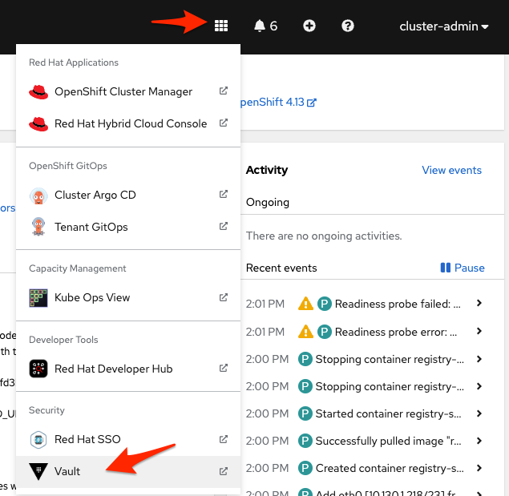
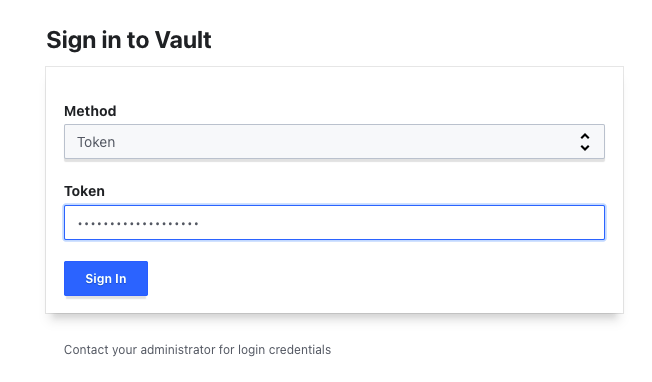
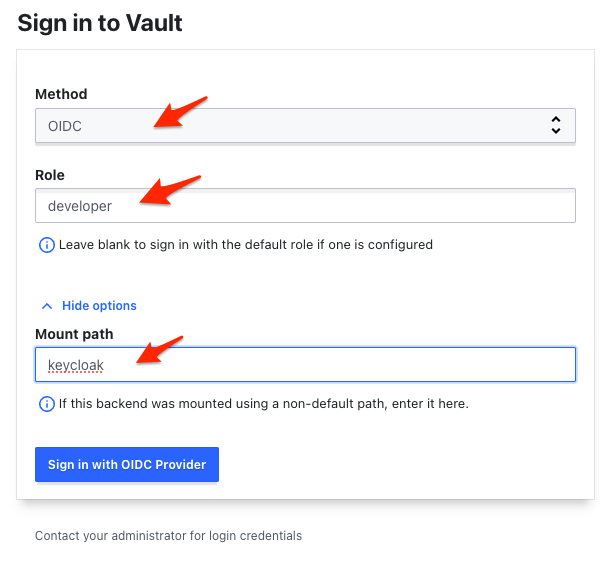

# Environment as a Service

This repo contains a set of gitops configuration to setup a developer platform based on OpenShift.

This repo mainly focuses on the Environment as a Service use case.

This repo tries to showcase a realistic scenario featuring:

1. a multi cluster setup: we have three cluster at play, hub, non-prod prod. Other clusters can be easily added.
2. a multi tenant setup: we have two teams configured: team-a, team-b. More teams can be easily added.
3. a multi environment setup: each application can have multiple environments. In this example we have: dev, qa (running in the non-prod cluster) and prod (running in the prod cluster)

This is a gitops repo build from the red hat CoP [starter template](https://github.com/redhat-cop/gitops-standards-repo-template) and populated ion large part with elements from the red hat CoP [gitops catalog](https://github.com/redhat-cop/gitops-catalog)

This example was built starting from the [AWS ROSA Open Environment](https://demo.redhat.com/catalog?search=rosa&item=babylon-catalog-prod%2Fsandboxes-gpte.rosa.prod) [Red Hat demo catalog](https://demo.redhat.com/catalog) item, you might have to adjust pieces of the configuration if you start from a different place. Adjustments should be minimal. 

To get started run the following:

```sh
#<the Git repo URL hosting the infrastructure manifests>
export gitops_repo=https://github.com/environment-aas/platform-iac
#<the Git repo URL hosting team's namespaces (where PRs requesting new namespces should be issued to)>
export gitops_namespaces_repo=https://github.com/environment-aas/namespaces
#<the Git organization URL hosting Tenant's apps manifests>
export tenant_gitops_org_url=https://github.com/environment-aas
#<your hub cluster name, typically "hub">
export cluster_name=hub
export cluster_base_domain=$(oc get ingress.config.openshift.io cluster --template={{.spec.domain}} | sed -e "s/^apps.//")
export platform_base_domain=${cluster_base_domain#*.}
oc apply -f .bootstrap/subscription.yaml
oc apply -f .bootstrap/cluster-rolebinding.yaml
envsubst < .bootstrap/argocd.yaml | oc apply -f -
envsubst < .bootstrap/root-application.yaml | oc apply -f -
```

To get the prod and non-prod cluster created you'll have to prepare a secret in the way ACM expects it. Here is an example of this secret required by ACM.

Create this file `./.rosa/aws-secret.yaml`, then copy&paste the following secret yaml content inside it. Then replace each property value accordingly to your environment's secret keys/credentials.

```yaml
apiVersion: v1
stringData:
  additionalTrustBundle: ""
  aws_access_key_id: "-----"
  aws_secret_access_key: "-----"
  baseDomain: "the root domain of the SOA Record in your DNS"
  httpProxy: ""
  httpsProxy: ""
  noProxy: ""
  pullSecret: "copy yours from https://console.redhat.com/openshift/downloads#tool-pull-secret"
  ssh-privatekey: "-----"
  ssh-publickey: "-----"
kind: Secret
metadata:
  labels:
    cluster.open-cluster-management.io/credentials: ""
    cluster.open-cluster-management.io/type: aws
  name: aws-credentials
  namespace: open-cluster-management
type: Opaque
```

then run:

```sh
oc delete secret aws-credentials -n open-cluster-management
oc apply -f ./.rosa/aws-secret.yaml
```

> NOTE: you can also use the ACM Console to create it following the UI guided form. Go to https://your-console-url/multicloud/credentials, and select your cloud provider (AWS in our case).

> NOTE: after creating this `aws-secret` you may also "force" Argo to reconsile the `ClusterDeployment` resource for bothe `prod` and `non-prod`. To do that go to ArgoCD Console open the `non-prod` Application and manually delete the `clusterdepoyment` resource. This will force Argo reconsile it and start the cluster provisioning job.
> 

To deploy RHDH your need a secret with a GitHub PAT so the Software Template we are using is able to create a PR for the requested Namespace. Go to your GitHub account Settings and issue a new Personal Access Token. Then create a secret definition like follows.

Create this file `./.rosa/github-pat-secret.yml`, then copy&paste the secret yaml content inside it.

```yaml
apiVersion: v1
kind: Secret
metadata:
  name: github-pat
stringData:
  github-pat: 'ghp_**********'
type: Opaque
```

```sh
oc create -f ./.rosa/github-pat-secret.yml -n redhat-developer-hub
```

## Accessing Vault UI.

Vault UI (as well other componets in this Lab) can be opened using the custom link available in the Openshift console menu.



To access Vault UI as privileged user you need to grab the root token from the kube-secret (`vault-init`) hosted inside the `vault` namespace in the **hub** cluster. Then, from the UI choose `token` as *Auth Method*.



To access Vault UI as a regular user (developer) choose the `OIDC` and enter `developer` as **Role** and `keycloak` as **Path** (under `More Options`). After clicking on `Sign in with OIDC Provider` expect a keycloak pop-up window asking for your credentials.


